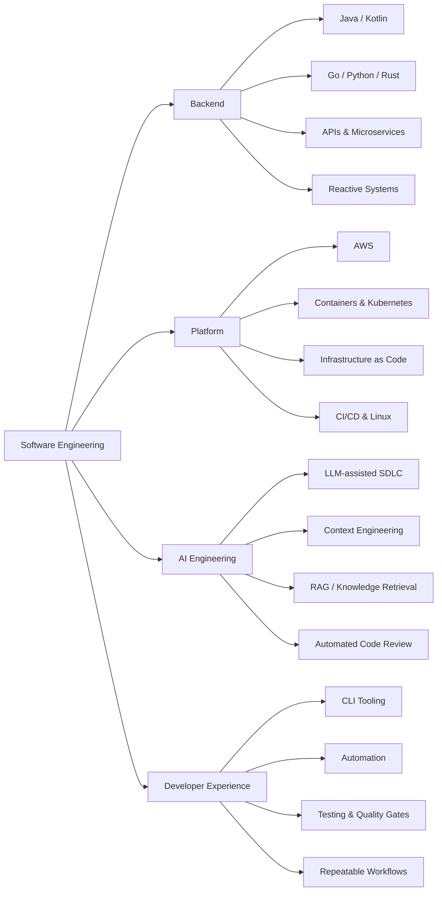

# Senior Software Engineer · Backend · Distributed Systems · AI Engineering

**15+ years building APIs, backend services, platform tooling and developer workflows.**

Java · Kotlin · Go · Python · Rust · TypeScript  
Spring · Quarkus · Reactive Systems · Cloud Native · DevOps · AI-assisted Engineering

---

I design and build software with a strong backend and systems mindset. My work spans **APIs and microservices, reactive applications, cloud infrastructure, developer tooling, automation and production-oriented engineering**.

I care about software that remains understandable and operable after it reaches production: clear boundaries, explicit failure modes, useful observability, repeatable delivery, secure integrations and pragmatic architecture.

## Engineering focus

| Area | What I work with |
|---|---|
| **Backend & APIs** | REST APIs, microservices, service integration, asynchronous and reactive processing |
| **JVM engineering** | Java, Kotlin, Spring Boot, Spring WebFlux, coroutines, R2DBC, Quarkus, GraalVM native builds |
| **Cloud & platform** | AWS, Docker, Kubernetes, Terraform, CI/CD, GitHub Actions, Linux |
| **Data & persistence** | PostgreSQL, MySQL, MongoDB, Redis, SQL, reactive persistence |
| **Security & integration** | JWT, 2FA, secret management, Vault, authentication flows, service-to-service integration |
| **Developer experience** | CLI tooling, automation, repeatable workflows, code quality gates, testing and repository conventions |

## AI engineering

AI is part of my engineering workflow, not a replacement for engineering judgment.

- **LLM-assisted software development** for implementation, investigation, refactoring and technical documentation.
- **Model-agnostic code-review workflows** with explicit review depth, evidence gathering and human verification.
- **Context engineering** for long-running technical investigations and repository-aware assistants.
- **RAG and knowledge workflows** for retrieving and structuring technical context.
- **AI-assisted automation** for software engineering and media-processing pipelines.
- **Human-in-the-loop validation**: independent review, reproducible evidence and deterministic checks whenever possible.

## Core stack

  
  
  
  
  
  
  
  

  
  
  
  
  
  

  
  
  
  
  

## Engineering landscape

## Public engineering experiments

My public repositories document hands-on exploration across:

- reactive JVM services with **Spring WebFlux**, **Kotlin coroutines** and **R2DBC**;
- **Quarkus** and **GraalVM native-image** behavior;
- custom **Kubernetes operators** with Python;
- **Go** integrations with secret-management systems;
- protocol and networking experiments;
- authentication and security proofs of concept;
- Python, C++, TypeScript and other language-learning repositories.

The goal is usually the same: isolate a technical question, build a reproducible example, understand the behavior and keep the result as executable documentation.

## GitHub activity

  <picture>
    <source media="(prefers-color-scheme: dark)" srcset="https://github-readme-stats.vercel.app/api?username=rgiaviti&show_icons=true&hide_border=true&include_all_commits=true&rank_icon=github&theme=github_dark_dimmed" />
    <source media="(prefers-color-scheme: light)" srcset="https://github-readme-stats.vercel.app/api?username=rgiaviti&show_icons=true&hide_border=true&include_all_commits=true&rank_icon=github&theme=default" />
    
  </picture>
  <picture>
    <source media="(prefers-color-scheme: dark)" srcset="https://github-readme-stats.vercel.app/api/top-langs/?username=rgiaviti&layout=compact&langs_count=10&hide_border=true&theme=github_dark_dimmed" />
    <source media="(prefers-color-scheme: light)" srcset="https://github-readme-stats.vercel.app/api/top-langs/?username=rgiaviti&layout=compact&langs_count=10&hide_border=true&theme=default" />
    
  </picture>

  <picture>
    <source media="(prefers-color-scheme: dark)" srcset="https://github-readme-activity-graph.vercel.app/graph?username=rgiaviti&theme=github-compact&hide_border=true&area=true" />
    <source media="(prefers-color-scheme: light)" srcset="https://github-readme-activity-graph.vercel.app/graph?username=rgiaviti&theme=minimal&hide_border=true&area=true" />
    
  </picture>

Charts above are generated from public GitHub data and may be temporarily affected by third-party service rate limits.

## How I approach engineering

- Prefer **simple boundaries and explicit contracts** over framework-driven complexity.
- Debug with **evidence, instrumentation and reproducible experiments**.
- Treat **observability, testing and operability** as part of the implementation.
- Automate repetitive engineering work, but keep critical decisions reviewable.
- Use AI to increase investigation and delivery throughput while keeping **verification and accountability deterministic**.
- Learn technologies by building small systems that expose their real runtime behavior.

---

**Backend systems · Cloud-native engineering · Developer tooling · AI-augmented software development**

