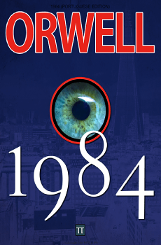
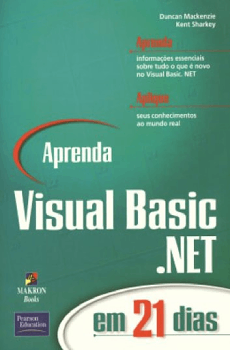
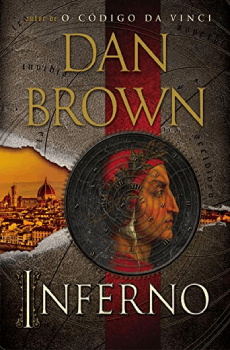
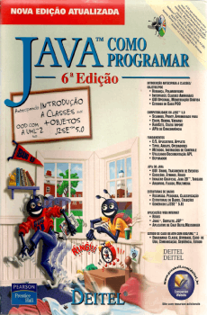
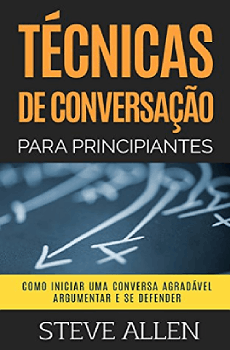
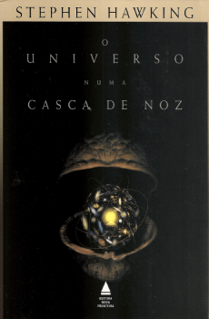

# Books Already Read

Here are the books I've read. Many of them were read in Portuguese, so the covers are in Portuguese. As I read more books, I will update this page.

All the books are in alphanetical order.

## Books

## List
| Title | Author |
| ----- | ------ |
| 1984 | George Orwell |
| Anjos e Demônios | Dan Brown |
| O Código Da Vinci | Dan Brown |
| Aprenda VB.NET em 21 Dias | Duncan Mackenzie e Kent Sharkey |
| Core Java Server Faces | David Geary e Cay Horstmann |
| Desenvolvimento Web Ágil com Rails | David Heinemeier Hansson e Dave Thomas |
| O Fim da Infância | Arhur C. Clarke |
| Inferno | Dan Brown |
| Java - Como Programar | H. M. Deitel |
| Quem Pensa Enriquece | Napoleon Hill |
| A Sabedoria da Transformação | Monja Coen |
| O Símbolo Perdido | Dan Brown |
| Só Não É Rico Quem Não Quer | Marcelo Veiga |
| Técnicas de Conversação para Principiantes | Steve Allen |
| The Witcher - O Último Desejo | Andrzej Sapkowski |
| O Universo em uma Casca de Noz | Stephen Hawking |
| Zen Para Distraídos | Nilo Cruz e Monja Coen |
